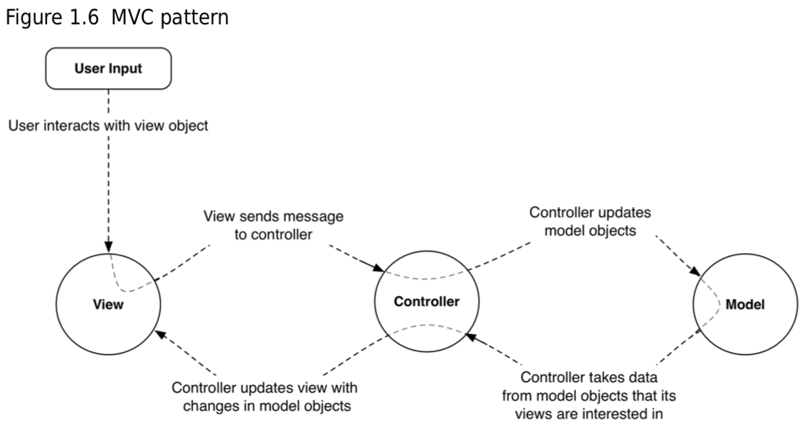

# Chapter 1 A Simple iOS Application

## Model-View-Controller(MVC)
MVC는 iOS 개발에서 사용되는 디자인 패턴으로 MVC 하의 모든 인스턴스는 *model* 레이어, *view* 레이어, 그리고 *controller* 레이어에 속한다.

- Model: 모델 레이어는 데이터를 가지고 있고 유저 인터페이스(UI)에 대해 알지 못한다. 일반적으로 사용자의 세계에 존재하는 실제적인 존재들을 표현한다.
- View: 뷰 레이어는 사용자에게 보여지는 객체들을 포함한다. *buttons*, *text fields*, *sliders*와 같은 것들이 뷰 객체의 예가 되며 UI를 구성한다.
- Controller: 컨트롤러 레이어는 어플리케이션이 관리되는 곳이다. 컨트롤러 객체 또는 컨트롤러는 어플리케이션의 관리자이며 사용자가 보는 뷰를 구성하고 뷰와 모델 객체가 동기화된 상태를 유지하도록 한다. 일반적으로 컨트롤러는 "And then?" 질문을 다루게 되는데 예를 들어 사용자가 리스트에서 한 아이템을 선택했을 때 그 다음 볼 것을 컨트롤러가 결정한다.

Figure 1.6은 버튼을 탭하는 등의 유저 입력에 대한 어플리케이션의 흐름이다.

여기서 알아두어야 할 것은 **모델과 뷰는 서로 직접적으로 이야기하지 않는다는 것이다.** 컨트롤러가 중간에 앉아서 메시지를 받고 명령을 전달한다.

