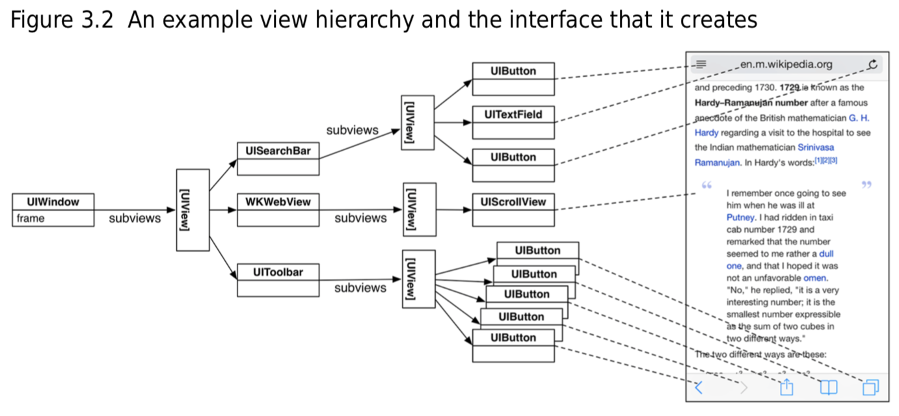

# Chapter 3 Views and the View Hierarchy

## View Basics
뷰 객체는:
- `UIView` 또는 하위 클래스의 인스턴스이다.
- 그 자신을 어떻게 그릴지 알고 있다.
- 터치 같은 이벤트를 처리한다.
- 어플리케이션의 윈도우를 루트로 가지는 뷰 계층 안에 존재한다.

## The View Hierarchy
모든 어플리케이션은 앱의 모든 뷰들의 컨테이너 역할을 하는 `UIWindow`의 인스턴스를 하나씩 가지고 있다. 윈도우는 `UIView`의 하위 클래스이기 때문에 그 자체로 뷰이며 앱이 실행될 떄 생성된다. 윈도우가 만드러지면 윈도우에 다른 뷰를 추가할 수 있다.

뷰가 윈도우에 추가되면 그 뷰는 윈도우의 *subview*가 된다. 또한 그 뷰들도 다시 하위 뷰를 가질 수 있고 그렇게 해서 만들어지는 것이 뷰 계층이다.

뷰 계층이 만들어지면, 화면에 그려진다. 두 과정으로 나눌 수 있다.
- 윈도우를 포함해서 계층 안의 각각의 뷰는 자기 자신을 그린다. 뷰는 그 자체를 `CALayer`의 인스턴스인 *layer*에 나타낸다.
- 모든 뷰의 레이어들이 화면에 합성된다.

## Views and Frames
`UIView`의 프로퍼티인 `frame`은 `CGRect` 타입으로 그 뷰의 크기와 상위 뷰에 대한 위치를 표현한다.

> 상위 뷰에 대한 위치를 표현하는 `frame`과 달리 `bounds`는 자신의 좌표계를 표현한다.

## The Auto Layout System
절대적 좌표를 사용할 경우 레이아웃을 쉽게 깨지게 하기 때문에 상대적인 방식으로 뷰의 레이아웃을 기술하는 오토 레이아웃을 사용한다. 런타임 시에 frame을 결정하게 하기 때문에 기기의 화면 크기를 고려한 레이아웃을 적용할 수 있다.

### The alignment rectangle and layout attributes
오토 레이아웃 시스템은 *alignment rectangle(정렬 사각형)*을 기반으로 한다. 이 사각형은 몇 가지 *layout attributes(레이아웃 속성)*들을 가진다.

- Width/Height: 정렬 사각형의 사이즈를 결정한다.
- Top/Bottom/Left/Right: 정렬 사각형의 가장자리와 뷰 계층의 다른 뷰의 정렬 사각형 사이의 여백을 결정하는 값이다.
- CenterX/CenterY: 정렬 사각형의 중앙 위치의 값이다.
- FirstBaseline/LastBaseline: 대부분 bottom 속성과 같다. 그러나 `UITextField`에서는 정렬 사각형의 bottom 대신 텍스트의 밑부분을 baseline으로 잡는다.
- Leading/Trailing: 언어에 특정한 속성이다. LtoR의 경우 Left와 Right와 같지만 아랍어 같은 RtoL의 경우 반대로 Leading은 오른쪽, Trailing은 왼쪽이 해당된다.

이러한 제약 조건을 제공하여 시스템이 정렬 사각형을 결정할 수 있도록 한다.